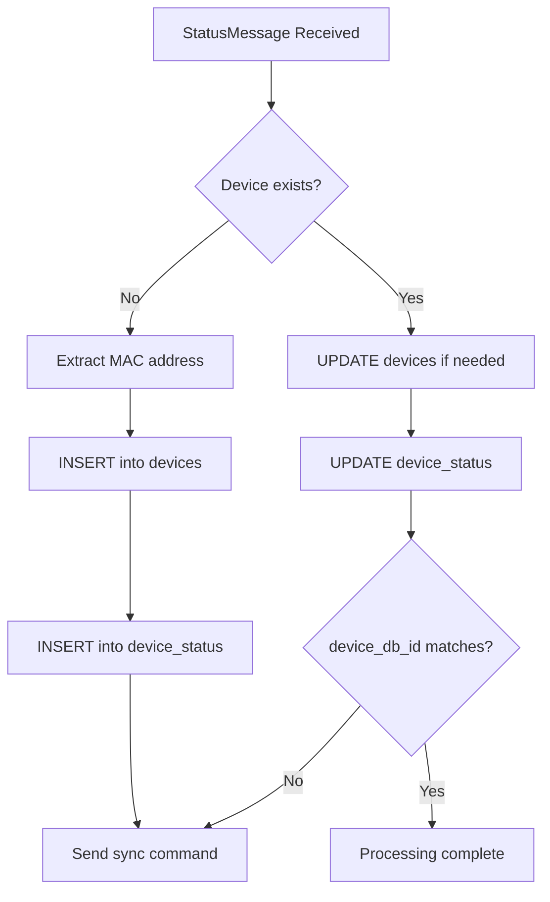
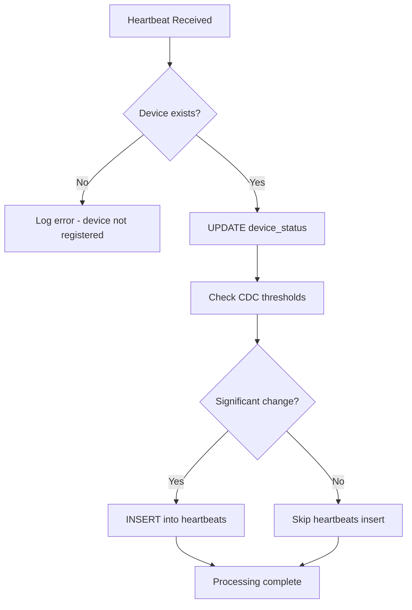
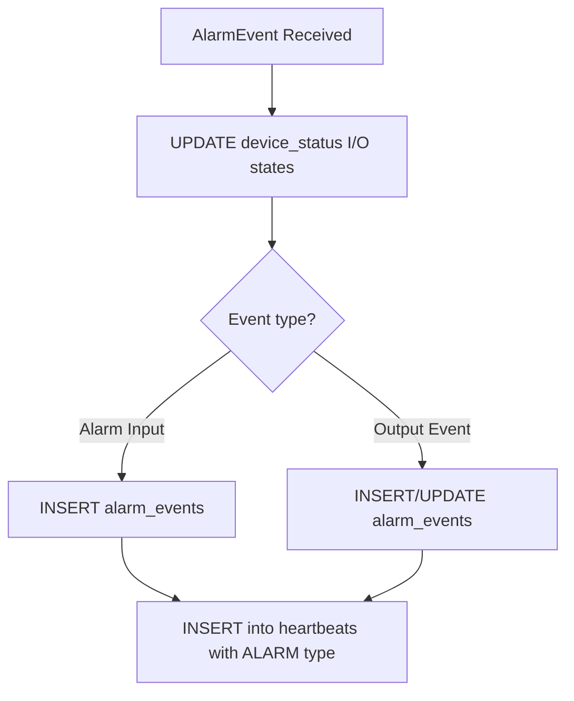
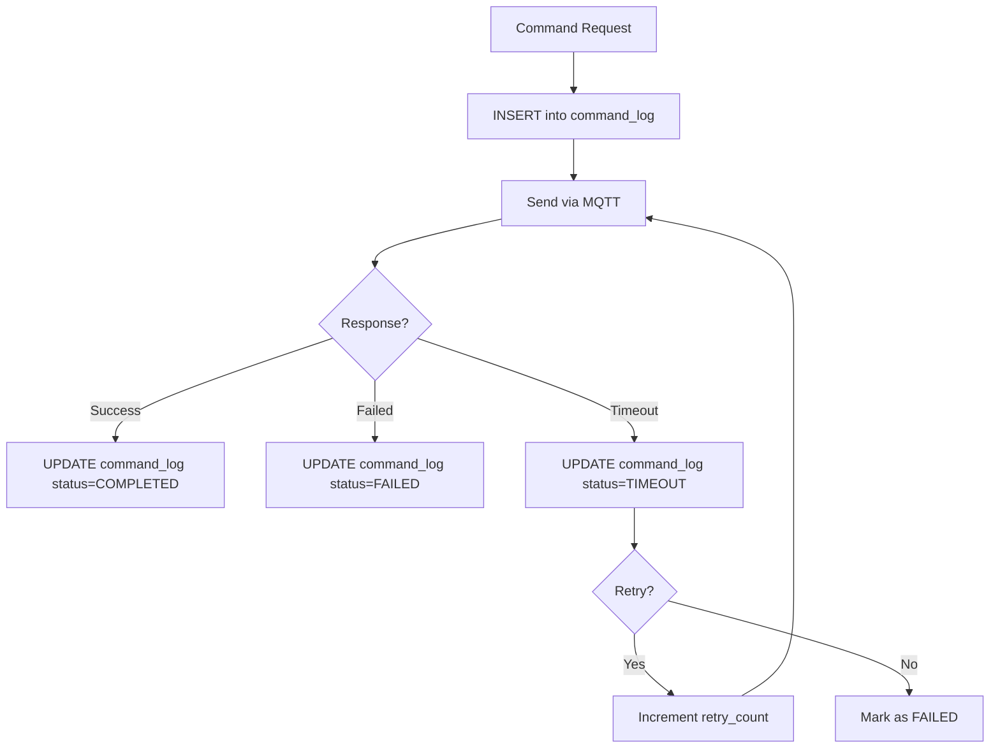

# Backend Database Considerations

## Overview
This document describes the database schema implementation for the ESP32 Alarm System, including table relationships, data flow from MQTT messages, and CDC (Change Data Capture) implementation details.

## Database Tables

### 1. `devices` Table
**Purpose**: Stores static device information that rarely changes.

| Field | Type | Description | Source |
|-------|------|-------------|--------|
| id | SERIAL PRIMARY KEY | Device database ID (sent to ESP32) | Auto-generated |
| mac_address | MACADDR UNIQUE NOT NULL | Device MAC address | StatusMessage.mac_address |
| hostname | VARCHAR(32) | Device hostname (ESG_ALARM_XXXX) | MQTT topic |
| country | VARCHAR(3) | Country code | StatusMessage.country |
| zone | INTEGER | Zone assignment | StatusMessage.zone |
| latitude | NUMERIC(10,7) | GPS latitude | StatusMessage.latitude |
| longitude | NUMERIC(10,7) | GPS longitude | StatusMessage.longitude |
| location_desc | TEXT | Human-readable location | Manual entry |
| installation_date | TIMESTAMPTZ | Physical installation date | Manual entry |
| notes | TEXT | Admin notes | Manual entry |
| active | BOOLEAN DEFAULT true | Device active status | Manual entry |
| created_at | TIMESTAMPTZ DEFAULT NOW() | First seen timestamp | Auto-generated |
| updated_at | TIMESTAMPTZ DEFAULT NOW() | Last update timestamp | Auto-trigger |

### 2. `device_status` Table
**Purpose**: Maintains current state of each device (always up-to-date).

| Field | Type | Description | Updated By |
|-------|------|-------------|------------|
| device_id | INTEGER PRIMARY KEY | Reference to devices.id | StatusMessage/Heartbeat |
| is_online | BOOLEAN DEFAULT false | Online status | Any message received |
| last_seen | TIMESTAMPTZ | Last message timestamp | Any message received |
| firmware_version | VARCHAR(16) | Current firmware | StatusMessage.firmware / Heartbeat.firmware |
| partition | INTEGER | OTA partition (0/1/2) | StatusMessage.partition |
| ota_validated | BOOLEAN | Firmware validation status | StatusMessage.ota_validated |
| uptime | INTEGER | Seconds since boot | StatusMessage.uptime / Heartbeat.uptime |
| boot_count | INTEGER DEFAULT 0 | Total reboots | StatusMessage.boot_count |
| device_state | VARCHAR(20) | Current state | StatusMessage.state |
| state_duration | INTEGER | Seconds in current state | StatusMessage.state_duration |
| free_heap | INTEGER | Free memory bytes | StatusMessage.free_heap |
| min_heap | INTEGER | Minimum heap recorded | StatusMessage.min_heap |
| network_type | VARCHAR(10) | wifi/ethernet/none | StatusMessage.network / Heartbeat.eth_interface |
| ip_address | INET | Current IP | StatusMessage.ip_address |
| rssi | INTEGER | WiFi signal strength | StatusMessage.rssi |
| connected | BOOLEAN | Network connected | StatusMessage.connected |
| has_ip | BOOLEAN | Has IP assigned | StatusMessage.has_ip |
| mqtt_connected | BOOLEAN | MQTT status | StatusMessage.mqtt_connected |
| ntp_synced | BOOLEAN | NTP sync status | StatusMessage.ntp_synced |
| last_ntp_sync | TIMESTAMPTZ | Last NTP sync | StatusMessage.last_ntp_sync |
| panic1 | BOOLEAN DEFAULT false | Panic button 1 | StatusMessage.panic1 / Heartbeat.panic1 |
| panic2 | BOOLEAN DEFAULT false | Panic button 2 | StatusMessage.panic2 / Heartbeat.panic2 |
| box_sw | BOOLEAN DEFAULT false | Tamper switch | StatusMessage.box_sw / Heartbeat.box_sw |
| siren | BOOLEAN DEFAULT false | Siren output | StatusMessage.siren / Heartbeat.siren |
| turret | BOOLEAN DEFAULT false | Turret output | StatusMessage.turret / Heartbeat.turret |
| panic1_count | INTEGER DEFAULT 0 | Total panic1 activations | StatusMessage.panic1_count |
| panic2_count | INTEGER DEFAULT 0 | Total panic2 activations | StatusMessage.panic2_count |
| tamper_count | INTEGER DEFAULT 0 | Total tamper events | StatusMessage.tamper_count |
| wifi_disconnects | INTEGER DEFAULT 0 | WiFi disconnect count | StatusMessage.wifi_disconnects |
| mqtt_disconnects | INTEGER DEFAULT 0 | MQTT disconnect count | StatusMessage.mqtt_disconnects |
| error_count | INTEGER DEFAULT 0 | Total errors | StatusMessage.error_count |
| temperature | REAL | Current temperature °C | StatusMessage.temperature / Heartbeat.temperature |
| humidity | REAL | Current humidity % | StatusMessage.humidity / Heartbeat.humidity |
| fan_pwm_duty | SMALLINT | Fan PWM 0-100% | Heartbeat.fan_pwm_duty |
| error_flags | INTEGER DEFAULT 0 | Error bitmap | StatusMessage.error_flags |
| device_synced | BOOLEAN DEFAULT false | device_db_id sync status | Computed |
| last_sync_attempt | TIMESTAMPTZ | Last sync attempt | System |
| updated_at | TIMESTAMPTZ DEFAULT NOW() | Last update | Auto-trigger |

### 3. `heartbeats` Table
**Purpose**: Historical data with CDC - stores only significant changes.

| Field | Type | Description | CDC Threshold |
|-------|------|-------------|---------------|
| time | TIMESTAMPTZ NOT NULL | Change timestamp | Always |
| device_id | INTEGER NOT NULL | Reference to devices.id | Always |
| temperature | REAL | Temperature if changed | > 0.5°C change |
| humidity | REAL | Humidity if changed | > 2% change |
| fan_pwm_duty | SMALLINT | Fan PWM if changed | > 5% change |
| panic1 | BOOLEAN | Panic1 state | Any change |
| panic2 | BOOLEAN | Panic2 state | Any change |
| siren | BOOLEAN | Siren state | Any change |
| turret | BOOLEAN | Turret state | Any change |
| box_sw | BOOLEAN | Tamper state | Any change |
| change_type | change_type_enum NOT NULL | Type of change | Always |

**change_type_enum values**:
- `ALARM` - Change in panic1, panic2, or box_sw
- `STATE_CHANGE` - Change in device_state
- `CONNECTION` - Change in is_online
- `SENSOR_DATA` - Change in temperature/humidity/fan
- `PERIODIC` - Forced periodic log (every 5 minutes)
- `MANUAL` - Manual/command triggered
- `MULTIPLE` - Multiple types of changes

### 4. `alarm_events` Table
**Purpose**: Registro de eventos de alarma y cambios de estado de salidas.

| Field | Type | Description | Source |
|-------|------|-------------|---------|
| id | SERIAL PRIMARY KEY | Event ID | Auto-generated |
| device_id | INTEGER | Reference to devices.id | AlarmEvent |
| sequence | INTEGER | Anti-replay sequence | AlarmEvent.sequence |
| timestamp | TIMESTAMPTZ | Event timestamp | AlarmEvent.timestamp |
| alarm_type | alarm_type_enum | Type of alarm/event | AlarmEvent.type |
| event_state | event_state_enum | Current state | AlarmEvent.state |
| priority | priority_enum | Priority level | AlarmEvent.priority |
| physical_state | BOOLEAN | Raw sensor state | AlarmEvent.physical_state |
| output_type | INTEGER | Output type (nullable) | AlarmEvent.output_type |
| pattern_type | INTEGER | Pattern type (nullable) | AlarmEvent.pattern_type |
| duration_seconds | INTEGER | Configured duration | AlarmEvent.duration_seconds |
| elapsed_seconds | INTEGER | Actual elapsed time | AlarmEvent.elapsed_seconds |
| created_at | TIMESTAMPTZ | Creation timestamp | Auto-generated |
| updated_at | TIMESTAMPTZ | Last update | Auto-trigger |

**alarm_type_enum values**:
- `UNKNOWN` (0), `PANIC1` (1), `PANIC2` (2), `TAMPER` (3), `FIRE` (4), `INTRUSION` (5), `MEDICAL` (6), `DURESS` (7), `OUTPUT_EVENT` (10)

**event_state_enum values**:
- `INACTIVE` (0) - Normal/Apagado/Patrón terminado
- `ACTIVE` (1) - Activo/Encendido/Patrón en ejecución
- `TEST` (2) - Modo prueba
- `STARTING` (3) - Patrón iniciando
- `STOPPING` (4) - Patrón terminando

**priority_enum values**:
- `LOW` (0), `MEDIUM` (1), `HIGH` (2), `CRITICAL` (3)

### 5. `command_log` Table
**Purpose**: Log of all commands sent to devices with tracking and responses.

| Field | Type | Description | Source |
|-------|------|-------------|---------|
| id | SERIAL PRIMARY KEY | Command log ID | Auto-generated |
| device_id | INTEGER | Reference to devices.id | Target device |
| request_id | UUID | Correlation ID | CommandEnvelope.request_id |
| sequence | INTEGER | Anti-replay counter | CommandEnvelope.sequence |
| timestamp | TIMESTAMPTZ | Command timestamp | CommandEnvelope.timestamp |
| command_type | command_type_enum | Type of command | CommandEnvelope type |
| command_data | JSONB | Full command payload | CommandEnvelope |
| auth_level | INTEGER | Auth level (0-2) | CommandEnvelope.auth_level |
| status | command_status_enum | Execution status | System tracking |
| sent_at | TIMESTAMPTZ | When sent to device | System |
| acknowledged_at | TIMESTAMPTZ | Device acknowledgment | CommandResponse |
| completed_at | TIMESTAMPTZ | Completion time | CommandResponse |
| failed_at | TIMESTAMPTZ | Failure time | System |
| response_data | JSONB | Response payload | CommandResponse |
| response_code | INTEGER | Response code | CommandResponse |
| error_message | TEXT | Error details | CommandResponse/System |
| retry_count | INTEGER | Retry attempts | System |
| max_retries | INTEGER | Max retry limit | Configuration |
| next_retry_at | TIMESTAMPTZ | Next retry time | System |
| initiated_by | VARCHAR(50) | User/system ID | API/System |
| notes | TEXT | Additional notes | Manual |
| created_at | TIMESTAMPTZ | Creation timestamp | Auto-generated |
| updated_at | TIMESTAMPTZ | Last update | Auto-trigger |

**command_type_enum values**:
- `UNKNOWN`, `SYSTEM`, `CONFIG`, `OUTPUT`, `DIAGNOSTIC`, `OTA`

**command_status_enum values**:
- `PENDING`, `SENT`, `ACKNOWLEDGED`, `COMPLETED`, `FAILED`, `TIMEOUT`, `CANCELLED`

## Message Processing Flow

### 1. StatusMessage Processing



**Tables affected**:
1. **devices**: INSERT on new device, UPDATE location fields if changed
2. **device_status**: UPSERT all dynamic fields

### 2. Heartbeat Processing



**Tables affected**:
1. **device_status**: UPDATE temperature, humidity, fan_pwm_duty, I/O states, uptime, network_type, firmware_version
2. **heartbeats**: INSERT only if CDC thresholds exceeded

**CDC Thresholds**:
- Temperature: ≥ 0.5°C change
- Humidity: ≥ 2% change  
- Fan PWM: ≥ 5% change
- I/O states: Any change
- Periodic: Force insert every 5 minutes

### 3. AlarmEvent Processing



**Tables affected**:
1. **device_status**: UPDATE panic1/panic2/box_sw/siren/turret states based on event
2. **alarm_events**: 
   - INSERT for new alarms (PANIC1, PANIC2, TAMPER)
   - INSERT for output events (SIREN, TURRET patterns)
   - UPDATE resolved_at when alarm clears
3. **heartbeats**: INSERT with change_type='ALARM' for state changes

### 4. Command Processing



**Tables affected**:
1. **command_log**: INSERT command, track status, store response

## Critical Relationships and Triggers

### 1. Device Registration Flow
```sql
-- When new device is detected (from any message):
1. INSERT into devices (mac_address, hostname, ...)
2. INSERT into device_status (device_id, default values)
3. Send SET_DEVICE_ID command to ESP32
```

### 2. Device Synchronization
```sql
-- Check on every message:
IF message.device_db_id != devices.id THEN
    UPDATE device_status SET device_synced = false
    Send SET_DEVICE_ID command
ELSE
    UPDATE device_status SET device_synced = true
END IF
```

### 3. CDC Logic for Heartbeats
```sql
-- Pseudo-code for heartbeat processing:
old_values = SELECT * FROM device_status WHERE device_id = X
new_values = heartbeat_message

-- Always update device_status
UPDATE device_status SET ... WHERE device_id = X

-- Check if should insert into heartbeats
should_insert = false
change_type = null

IF abs(new.temperature - old.temperature) >= 0.5 THEN
    should_insert = true
    change_type = 'SENSOR_DATA'
END IF

IF new.panic1 != old.panic1 OR new.panic2 != old.panic2 OR new.box_sw != old.box_sw THEN
    should_insert = true
    change_type = 'ALARM'  -- Takes priority
END IF

IF multiple_changes THEN
    change_type = 'MULTIPLE'
END IF

IF should_insert OR (last_heartbeat_insert > 5 minutes ago) THEN
    INSERT INTO heartbeats (...)
END IF
```

### 4. Cascade Delete
```sql
-- When device is deleted:
DELETE FROM devices WHERE id = X
-- Automatically deletes (CASCADE):
  -- device_status record
  -- all heartbeats records
  -- all alarm_events records
  -- all command_log records
```

### 5. Table Relationships
```
devices (1) ──┬── (1) device_status
              ├── (N) heartbeats
              ├── (N) alarm_events
              └── (N) command_log
```

## Performance Considerations

### 1. Index Usage
- **devices**: Indexed on mac_address for fast lookup
- **device_status**: Indexed on device_id (PRIMARY KEY)
- **heartbeats**: Composite indexes on (device_id, time) and (device_id, change_type, time)
- **alarm_events**: Indexes on (device_id, timestamp), (alarm_type, event_state), priority, active events, and OUTPUT_EVENT specific
- **command_log**: Indexes on device_id, request_id, status, command_type, timestamp, and pending commands

### 2. Update vs Insert
- **device_status**: Always UPDATE (one record per device)
- **heartbeats**: Always INSERT (append-only time-series)
- **alarm_events**: Always INSERT (append-only event log)
- **command_log**: INSERT for new commands, UPDATE for status changes
- **devices**: Rarely UPDATE (only static info changes)

### 3. CDC Benefits
- Reduces heartbeats storage by ~90-95%
- Only significant changes are logged
- Periodic snapshots ensure data completeness

## Network Type Mapping

| Message Type | Field | Value | Maps To |
|--------------|-------|-------|---------|
| Heartbeat | eth_interface | 0 | 'wifi' |
| Heartbeat | eth_interface | 1 | 'ethernet' |
| StatusMessage | network | NETWORK_WIFI (0) | 'wifi' |
| StatusMessage | network | NETWORK_ETHERNET (1) | 'ethernet' |
| StatusMessage | network | NETWORK_NONE (2) | 'none' |

## Error Handling

### 1. Unknown Device
- Heartbeat from unknown MAC → Log error, skip processing
- Status from unknown MAC → Create new device

### 2. Sync Failures
- Track sync attempts in device_status.last_sync_attempt
- Retry sync command with exponential backoff
- Alert after 3 failed attempts

### 3. CDC Edge Cases
- NULL old values → Treat as first insert, always log
- Multiple simultaneous changes → Use priority: ALARM > STATE_CHANGE > CONNECTION > SENSOR_DATA
- Clock skew → Use server timestamp, not device timestamp

## Maintenance Tasks

### 1. Periodic Cleanup (recommended)
```sql
-- Delete old heartbeats (keep 90 days)
DELETE FROM heartbeats WHERE time < NOW() - INTERVAL '90 days';

-- Delete old alarm_events (keep 180 days)
DELETE FROM alarm_events WHERE timestamp < NOW() - INTERVAL '180 days';

-- Delete old command_log (keep 30 days for completed/failed)
DELETE FROM command_log 
WHERE created_at < NOW() - INTERVAL '30 days'
AND status IN ('COMPLETED', 'FAILED', 'CANCELLED');

-- Mark offline devices
UPDATE device_status 
SET is_online = false 
WHERE last_seen < NOW() - INTERVAL '5 minutes';
```

### 2. Statistics Generation
```sql
-- Daily device statistics
SELECT 
    device_id,
    COUNT(*) as changes_today,
    COUNT(*) FILTER (WHERE change_type = 'ALARM') as alarms_today
FROM heartbeats
WHERE time > NOW() - INTERVAL '24 hours'
GROUP BY device_id;

-- Alarm statistics
SELECT 
    d.hostname,
    ae.alarm_type,
    COUNT(*) as event_count,
    COUNT(*) FILTER (WHERE ae.event_state = 'ACTIVE') as active_count
FROM alarm_events ae
JOIN devices d ON ae.device_id = d.id
WHERE ae.timestamp > NOW() - INTERVAL '24 hours'
GROUP BY d.hostname, ae.alarm_type;

-- Command success rate
SELECT 
    command_type,
    COUNT(*) as total_commands,
    COUNT(*) FILTER (WHERE status = 'COMPLETED') as successful,
    ROUND(100.0 * COUNT(*) FILTER (WHERE status = 'COMPLETED') / COUNT(*), 2) as success_rate
FROM command_log
WHERE created_at > NOW() - INTERVAL '7 days'
GROUP BY command_type;
```

## Future Considerations

### 1. TimescaleDB Integration
- Convert heartbeats to hypertable for better time-series performance
- Enable automatic compression after 7 days
- Implement continuous aggregates for real-time statistics

### 2. Partitioning Strategy
- Partition heartbeats by month for easier maintenance
- Archive old partitions to cold storage

### 3. Real-time Triggers
- WebSocket notifications on ALARM changes
- Alert system for critical events
- Dashboard real-time updates